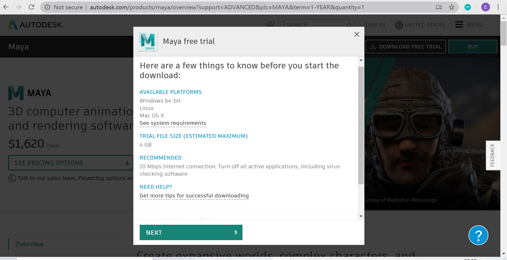
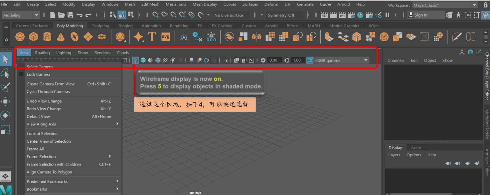
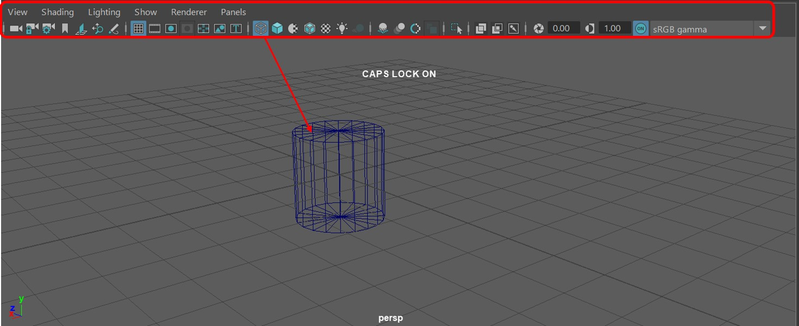
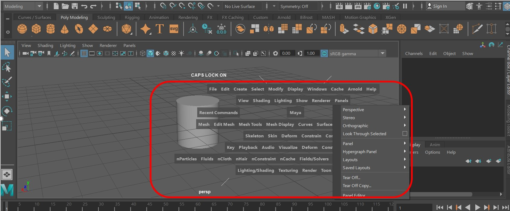
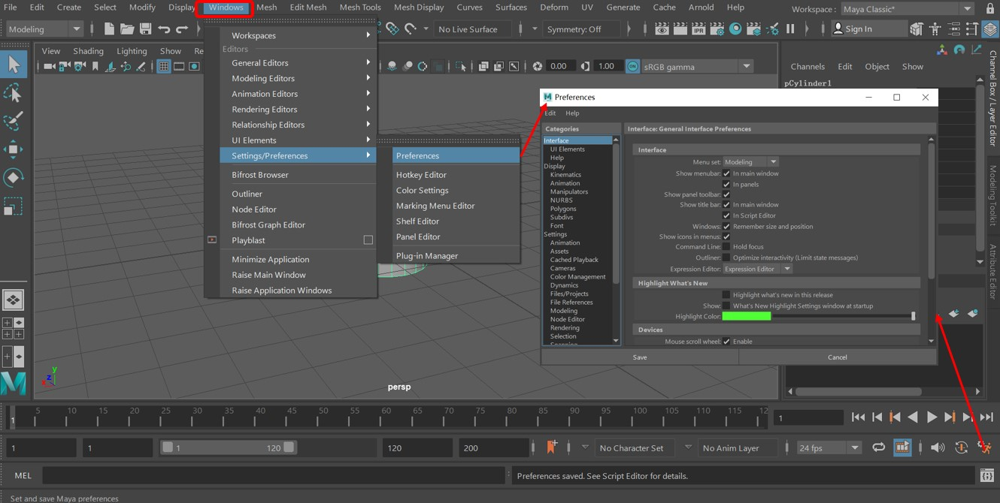
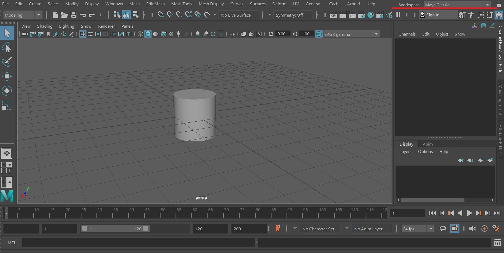
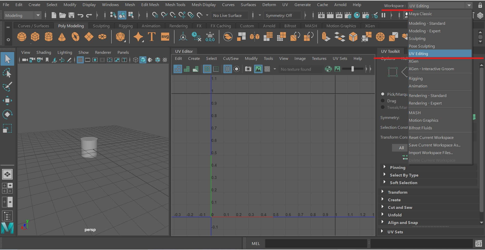
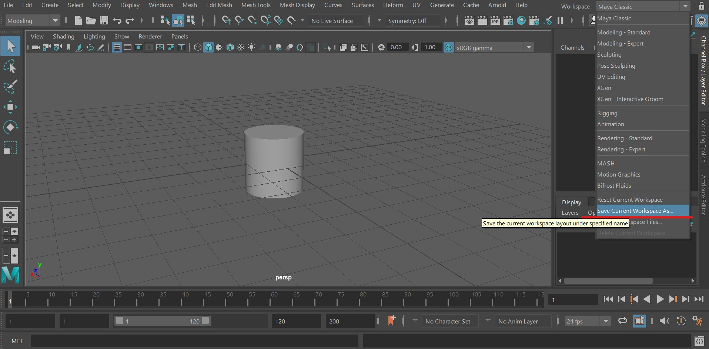
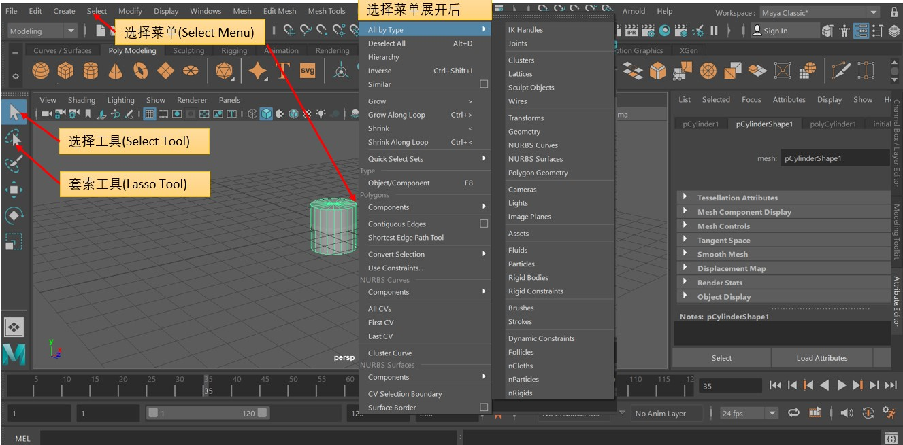

### `1. 软件下载 & 安装`
Maya安装比较简单，点击链接进入AUTODESK官网, 点击下载，选择适合自己电脑的版本即可。

Maya是一款付费软件，但是有30天的免费试用期，过了30天如果想继续使用，需要去官网购买。

图片来自网络, 侵权请告知

当然网上有很多破解版，有需要的可以自行了解，笔者也是一个小白，就不瞎推荐了，当然豪们支持正版会更香。

图片来自网络, 侵权请告知

### `2. MAYA简单使用`

1. **视图导航——Navigation**
- 旋转视图：ALT + MLB(鼠标左键)，移动鼠标，视图会进行旋转。
- 平移视图：ALT + MMB(鼠标滚轮)，移动鼠标，视图会上下移动或者水平移动。
- 放大缩小：ALT + MRB(鼠标右键)，移动鼠标，视图会放大或者缩小。
2. **视配置视图——View Configuration**
- 保存位置： Files > scences > xx.ma
在视图区域选择想要的类型，也支持数字快捷键

例如一个圆柱，选择“4”，以“wireFrame”显示，如下图：

3. **热箱和标记菜单—— the Hotbox and Marking Menus**
`热箱`
长按空格键, 就会出现热箱，上面是所有的菜单按钮

4. **自定义窗口—— Customize the Interface**
MAYA支持自定义窗口，以便使用者在创作的时候快速找到当前工作需要的按钮和功能，而不是在茫茫菜单中一个个的去找。
MAYA自定义窗口的途径有以下方式：
1). Windows > Windows/Preference > preference
2). 右下角的快捷按钮(图中右边的箭头所示)

3). 通过workspace快速配置
如下图所示，我们可以选择MAYA已经定义好的样式，例如`maya Classic`, `Modeling Standard`, `Modeling Expert` … 也支持保存自定义的样式，同时可以打开我们自定义好的视图。
`经典样式`：

`UV Editing：`

`保存我们的workspace：`

5. **选择对象—— Select Objects**
MAYA中选择物体的方法有很多，以下简单介绍一下：

1). 选择单个物体 
点击 `选择工具(Select Tool)`, 然后使用鼠标左键点击需要选择的物体，那么当前被点击的物体就被选中/取消选中了。  
2). 选择多个物体 
使用 `选择工具(Select Tool)`, 然后使用 `SHIFT + MLB(鼠标左键)`，点击不同的物体，就可以实现多个物体被选择或者被取消选择。  
3). 框选一个区域进行物体选择 
鼠标在 `选择工具(Select Tool)` 状态下，在画布某个区域按下鼠标左键，然后拖拽鼠标，就可以画出一个 矩形, 被当前这个矩形圈住的物体就会被选中。  
4). 套索工具 
在MAYA的左侧工具栏，选择 `套索工具(Lasso Tool)`, 然后选择想要的物体或者区域即可。  
5). 使用 Select Menu 
如果上述方式都满足不了，可以点击菜单栏上面的的 `选择菜单(Select Menu)`。从上面的展开图中我们可以看到，选择菜单有很多的选项，有 按相似度选择, 根据形状选择…… 使用者可以根据自己的需要进行选择。  
6). `CTRL + SHIFT + A` 快捷键选中所有物体。

---
> * 作者：孤城·慕雪
> * 时间：2020-06-25 12:43:57
> * 版权所有，欢迎保留原文链接进行转载`^_^`
> * 欢迎大家进行评论指正，一起交流学习，共同进步
---

