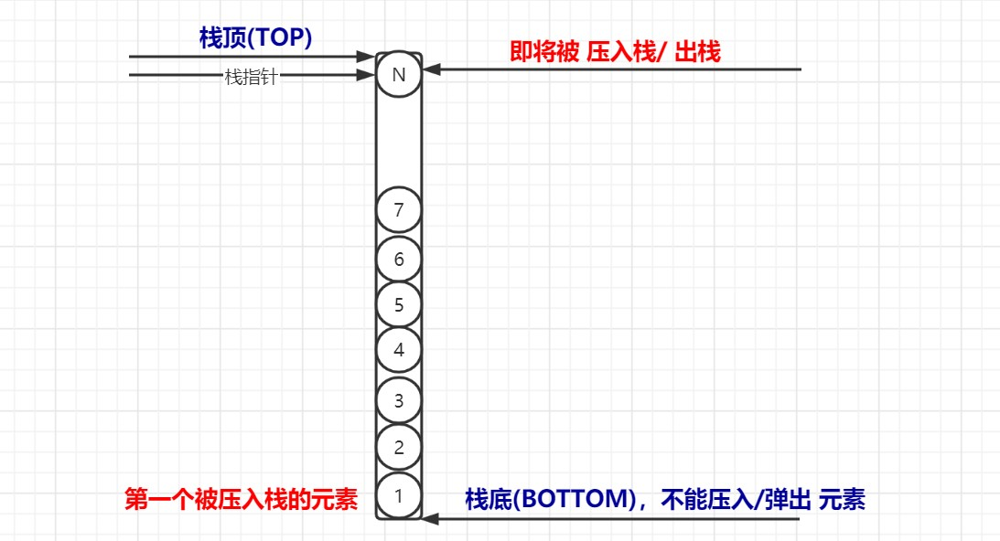

#### 1. 基本原理
栈是一种**线性**数据结构，按照特定的顺序进行数据操作(进栈/出栈)。栈的数据操作遵循『先进后出(FILO)』或『后进先出(LIFO)』的原则。
<div align=center ></div>

类似于栈这种数据结构在生活中也是很常见的。例如：我们有一个羽毛球筒(不被破坏的情况下，只能一端 “装入/取出” 羽毛球)。现在将7个不同颜色的羽毛球装在里面，假设第一个被装入羽毛球的颜色是红色的，然后陆续将其他颜色的羽毛球装入，最后一个羽毛球的颜色是蓝色的。
现在，第一个装入的红色羽毛球在筒底，最后一个装进的篮球色羽毛球在筒顶。如果想取羽毛球，第一个会被拿出来的是蓝色的，也就是最后一个被装入的羽毛球。这是一个简单的 **`栈`** 的例子。

#### 2. 基本操作
- **入栈**
向栈中压入元素的过程。如果栈已经满了，则抛出 **`栈溢出`** 异常。

- **出栈**
将栈中的元素从栈里面取出的过程。元素的弹出顺序与它们被推入的顺序相反，这是栈的性质决定的。如果栈是空栈，则抛出 **`空指针`** 异常。

- **Peek/Top**
返回栈顶元素的过程。

- **isEmpty**
用来判断栈是否为空。如果是空栈，则返回true，否则返回false。

#### 3. 应用场景
- 浏览器的前进和回退
- Undo和Redo
#### 4. 栈的实现
- 使用数组
- 使用链表
`使用数组的例子`
```
static MAX : number = 1000;
export class Stack {
    private top: number;
    private arr: number[] = Array(MAX);

    constructor() {
        this.top = -1;
    }

    public isEmpty(): boolean {
        this.top < 0;
    }

    public push(n: number): boolean {
        if (this.top >= (MAX - 1)) return falsel;
        this.top += 1;
        this.arr[this.top] = n;
        return true;
    }

    public pop(): number {
        if (this.top < 0) return null;
        const x = this.arr.pop();
        this.top -= 1;
        return x;
    }

    public peek(): number { 
        if (this.top < 0) return null;
        const x = this.arr[this.top]; 
        return x; 
    } 
}
```

---
> * 作者：孤城·慕雪
> * 时间：2020-05-01 10:11:18
> * 版权所有，欢迎保留原文链接进行转载`^_^`
> * 欢迎大家进行评论指正，一起交流学习，共同进步
---